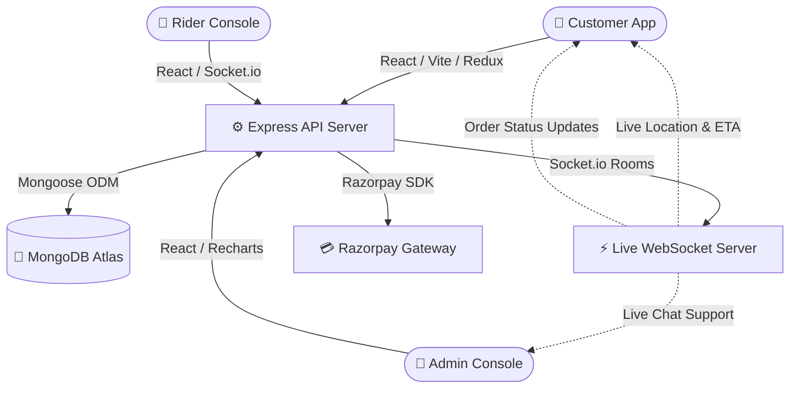

<div align="center">

```
  ⚡ G R O V I O
  ─────────────────
  DELIVERED SMARTER
```

<h1>🛒 Grovio — Fresh Groceries. Delivered Smarter.</h1>

<p>
  
  
  
  
  
  
</p>

<p>
  
  
  
  
</p>

</div>

---

## ⚡ What is Grovio?

**Grovio** is a **production-ready, full-stack Grocery Delivery System** built on the MERN stack.  
Customers browse thousands of products, place orders online, and get them delivered in **10 minutes flat** — with live GPS tracking, real-time notifications, and a seamless payment experience.

> Built by **Ayush Raj and team** — Jalandhar, Punjab 🇮🇳

---

## 🏗️ System Architecture



---

## ✨ Features

| Feature | Description |
|---------|-------------|
| 🛒 **Smart Cart** | Add/remove items, apply coupons, see live totals |
| 💳 **Payments** | Razorpay — UPI, Cards, Net Banking, COD |
| ⚡ **10-Min Delivery** | Real-time order tracking with live rider GPS |
| 🔔 **Notifications** | In-app bell with order status push updates |
| ❤️ **Wishlist** | Save favourite products, move to cart anytime |
| ⭐ **Reviews** | Star ratings + detailed reviews per product |
| 🎫 **Coupons** | Discount codes, seasonal offers, cashback |
| 📊 **Analytics** | Revenue charts, top products, delivery metrics |
| 🎧 **Support** | Raise tickets, live chat, refund requests |
| 🌙 **Dark Mode** | Full dark/light theme toggle |
| 📱 **Responsive** | Mobile-first, works on all screen sizes |
| 🔐 **Secure Auth** | JWT + Refresh Tokens + role-based access |

---

## 👥 User Roles

| Role | Access |
|------|--------|
| 🧑 **Customer** | Browse, cart, checkout, track, wishlist, reviews, support |
| 🛵 **Delivery Partner** | Assigned orders, GPS updates, delivery history |
| 🏪 **Store Manager** | Products, inventory, orders, analytics, coupons |
| 🔐 **Admin** | Full platform control — users, stores, reports, settings |

---

## 🛠️ Tech Stack

### Frontend
- **React 18** + React Router v6
- **Redux Toolkit** — global state management
- **Vite** — lightning fast build tool
- **TailwindCSS** — utility-first styling with dark mode
- **Socket.io-client** — real-time order & delivery tracking
- **Recharts** — analytics dashboards
- **jsPDF** — client-side PDF invoice generation
- **Razorpay Checkout** — payment UI

### Backend
- **Node.js** + **Express.js**
- **MongoDB Atlas** + Mongoose ODM
- **Socket.io** — real-time events (orders, chat, GPS)
- **JWT** + bcryptjs — secure authentication
- **Razorpay SDK** — payment processing & verification
- **Helmet** + CORS — security hardening

---

## 📁 Project Structure

```
Grovio/
├── backend/
│   └── src/
│       ├── controllers/      # Auth, Orders, Products, Analytics, Support...
│       ├── models/           # User, Product, Order, Review, Wishlist, Notification...
│       ├── routes/           # 15 API route modules
│       ├── middlewares/      # JWT protect, role restrict, error handler
│       ├── utils/            # Response helpers, Razorpay, token utils
│       └── server.js         # Express + Socket.io entrypoint
│
└── frontend/
    └── src/
        ├── components/       # Navbar, CartDrawer, NotificationBell, ProductCard...
        ├── pages/            # Home, Checkout, AdminDashboard, Wishlist, Support...
        ├── store/            # Redux: auth, cart, orders, wishlist, notifications
        ├── context/          # ThemeContext (dark/light)
        └── main.jsx          # Router config + Provider setup
```

---

## ⚡ Quick Start

### Backend
```bash
cd backend
npm install
# Create .env with MONGODB_URI, JWT_SECRET, RAZORPAY keys
npm run dev        # starts on port 5000
```

### Frontend
```bash
cd frontend
npm install
# Set VITE_API_URL=http://localhost:5000/api in .env
npm run dev        # starts on port 5173
npm run build      # production build → dist/
```

---

## 🌐 API Modules

| Endpoint | Description |
|----------|-------------|
| `/api/auth` | Register, Login, Refresh Token |
| `/api/products` | CRUD, search, category filter |
| `/api/categories` | Category management |
| `/api/cart` | Add, update, remove items |
| `/api/orders` | Place, track, cancel orders |
| `/api/payments` | Razorpay initiate & verify |
| `/api/coupons` | Validate & manage coupons |
| `/api/addresses` | User delivery addresses |
| `/api/inventory` | Stock logs & adjustments |
| `/api/analytics` | Revenue, orders, trends |
| `/api/support` | Tickets & live chat |
| `/api/wishlist` | Add/remove wishlist items |
| `/api/reviews` | Product ratings & reviews |
| `/api/notifications` | In-app notification system |
| `/api/health` | Server health check |

---

## 🚀 Deployment

| Service | Platform |
|---------|----------|
| **Backend** | [Render.com](https://render.com) (Free tier) |
| **Frontend** | [Vercel.com](https://vercel.com) (Free tier) |
| **Database** | MongoDB Atlas (Free 512MB) |

---

## 🏆 Production Checklist

- ✅ **Zero build errors** — 3168 modules compiled
- ✅ **JWT security** — cryptographic 128-char secrets
- ✅ **Password hashing** — bcrypt salt rounds
- ✅ **Helmet** — HTTP security headers
- ✅ **CORS** — restricted to client URL
- ✅ **Input validation** — Joi schema validators
- ✅ **Error handling** — global error middleware
- ✅ **SEO** — meta tags, OG tags, semantic HTML
- ✅ **Responsive** — mobile-first design
- ✅ **Dark mode** — full theme support

---

## 👨‍💻 Built By

<div align="center">

**Ayush Raj and team**  
📍 Jalandhar, Punjab, India  
📞 +91 83404 89386

</div>

---

<div align="center">
  <strong>⚡ Grovio — Fresh Groceries. Delivered Smarter.</strong><br/>
  <sub>Made with ❤️ for PEP Project 2026</sub>
</div>
