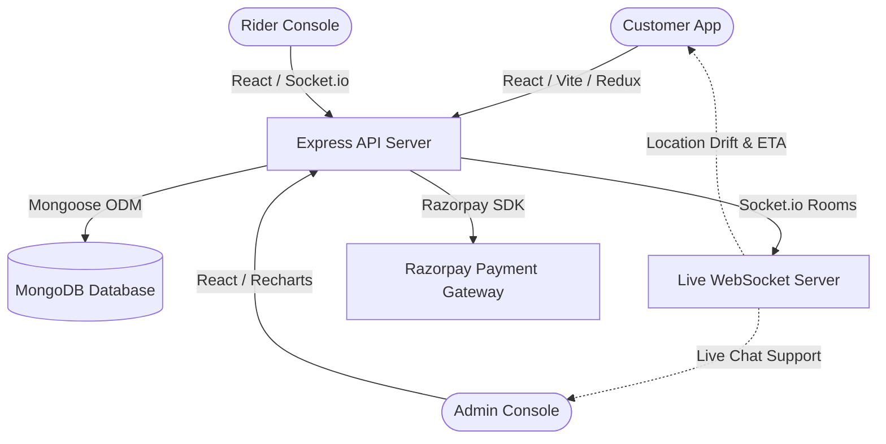

# Grovio 🥦
> **Fresh Groceries. Delivered Smarter.**

Grovio is a production-ready, enterprise-grade Grocery Delivery System. Built as a high-performance MERN-stack web application, it integrates real-time delivery tracking, automated inventory restocks, a customer support live chat helpdesk, Razorpay transaction management, and an enterprise analytics dashboard.

---

## 🏗️ System Architecture



---

## 🛠️ Tech Stack & Optimization Features

### Frontend (Client Console)
*   **Core**: React 18, React Router v6, Redux Toolkit (global state).
*   **Styling**: TailwindCSS, CSS Variables, dark mode toggle.
*   **Realtime**: `socket.io-client` syncing messaging threads and scooter tracks.
*   **Visualizations**: Recharts (Monthly Trends, Top Items), SVG Bezier Curve maps.
*   **Invoicing**: `jsPDF` client-side PDF document compiler.

### Backend (Server API)
*   **Core**: Node.js, Express, MongoDB, Mongoose.
*   **Realtime**: Socket.io mapping channels (`order_id`, `ticket_id`, admin room).
*   **Payments**: Razorpay Payment SDK with integrity verification hashes.
*   **Analytics Engine**: Native MongoDB aggregation pipelines.

---

## 👥 Role Permissions Matrix

| User Role | Operations Allowed |
| :--- | :--- |
| **Customer** | Catalog search, Cart drawer, address book, coupon codes, checkout, order timeline tracker, PDF invoices, support helpdesk chat, order cancellation requests. |
| **Delivery Partner (Rider)** | Active feeds list, self-assignment, location directions, live GPS simulation, drop-off OTP validation logs, earnings breakdowns. |
| **Store Manager** | Category lists, SKU catalog CRUD, coupon discounts configurations, inventory logs viewer, analytics, support chat, order status assignments. |
| **Admin** | User accounts manager, role updates, suspensions, catalog CRUD, coupon configurations, complete analytics, support helpdesk chat, order status adjustments. |

---

## 📁 Project Structure

```
Grocery Delivery System (PEP Project)
├── backend/
│   ├── src/
│   │   ├── controllers/      # Route handler controllers (auth, order, analytics, support...)
│   │   ├── models/           # Mongoose schemas (User, Product, Order, SupportTicket...)
│   │   ├── routes/           # Express endpoint definitions
│   │   ├── middlewares/      # Authentication & global error capture
│   │   ├── utils/            # Razorpay SDK helper, response formatters, custom errors
│   │   └── server.js         # Entrypoint & Socket connection mapping
│   ├── .env.example          # Environment configuration variables
│   └── package.json
│
├── frontend/
│   ├── src/
│   │   ├── components/       # Reusable elements (Navbar, CartDrawer, ErrorBoundary...)
│   │   ├── context/          # Dark/Light theme toggles
│   │   ├── pages/            # Core layout views (Home, Support, AdminDashboard...)
│   │   ├── store/            # Redux setup & Auth credentials slice
│   │   ├── utils/            # Axios API wrappers
│   │   └── main.jsx          # Route paths mapping & render mount
│   ├── .env.example          # Client-side endpoint targets
│   └── package.json
└── README.md
```

---

## ⚡ Quick Start Guide

### 1. Prerequisites
Ensure you have **Node.js (v18+)** and **MongoDB** running on your local machine.

### 2. Backend Setup
1. Navigate to the server folder:
   ```bash
   cd backend
   ```
2. Install packages:
   ```bash
   npm install
   ```
3. Copy environment configuration:
   ```bash
   cp .env.example .env
   ```
4. Update credentials inside `.env` (MongoDB connection URI, JWT secrets, Razorpay API keys).
5. Start development server:
   ```bash
   npm run dev
   ```

### 3. Frontend Setup
1. Navigate to the client folder:
   ```bash
   cd ../frontend
   ```
2. Install packages:
   ```bash
   npm install
   ```
3. Copy environment configuration:
   ```bash
   cp .env.example .env
   ```
4. Start development web server:
   ```bash
   npm run dev
   ```
5. Production build compile:
   ```bash
   npm run build
   ```

---

## 🏆 Production Audit Checklist

*   **API Integrity**: Standard response wrappers (`sendSuccess`, `sendError`), custom validation layers, and Global Error boundary capture.
*   **Security & Auth**: Secure hashed passwords (bcrypt), stateless JSON Web Tokens (JWT), role checking guards.
*   **Database Performance**: DB indexes defined on lookup fields (`userId`, `status`, `deliveryPartner`, `slug`).
*   **SEO & Web Vitals**: HTML5 semantic tags, aria-labels for buttons, dark/light theme options, responsive mobile navigation, bundle optimization.
